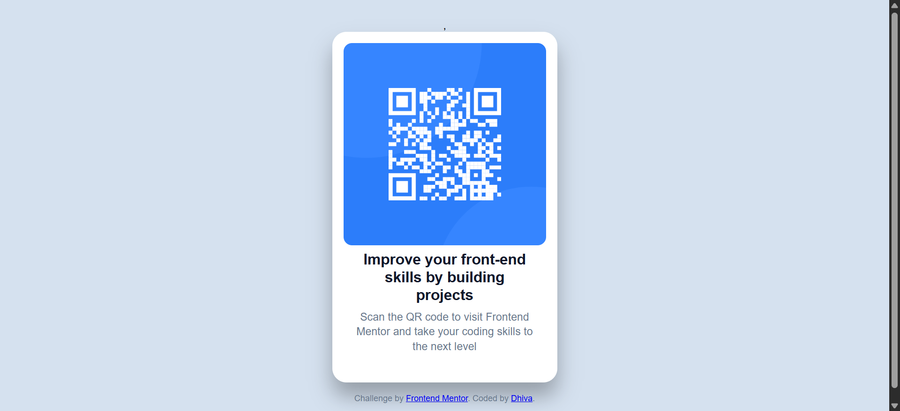

# Frontend Mentor - QR Code Component

This is my solution to the **QR Code Component** challenge from Frontend Mentor.

## 📌 Overview

This project is a simple QR code card built using HTML and CSS.  
The goal was to replicate the given design as closely as possible.

## 🔗 Live Demo

👉 Live Site: https://dhivagar-dev.github.io/qr-code-component-main/
👉 GitHub Repo: https://github.com/dhivagar-dev/qr-code-component-main.git

## 🛠 Built With

- HTML5
- CSS3
- Flexbox

## 🎯 What I Learned

While building this project, I improved my understanding of:

- Centering elements using Flexbox
- Reading and implementing Figma design specs
- Typography (line height, letter spacing)
- Spacing and layout alignment
- Creating clean UI components

## 📷 Screenshot

## 🚀 Continued Development

In future projects, I want to:

- Improve responsive design skills
- Build reusable components
- Implement more advanced layouts

## 👨‍💻 Author

- GitHub – [Dhiva]https://github.com/dhivagar-dev
- Frontend Mentor – https://www.frontendmentor.io/profile/dhivagar-dev

## 🙌 Acknowledgments

Thanks to Frontend Mentor for providing real-world UI challenges.
